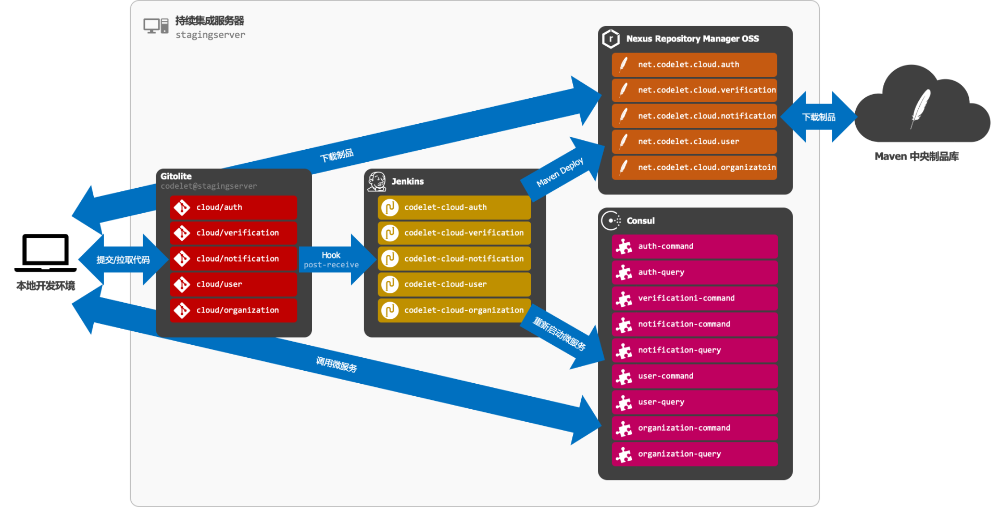

|实现目标|所使用的工具|
|:---|:---|
|安装项目所需的必要组件|Java SDK、ImageMagick、FFmpeg 等|
|各业务模块的代码通过独立的代码库管理|Git|
|各代码库可配置不同的访问控制，仅向指定的人员开放读/写权限|Gitolite|
|部署私有 Maven 库，从而使得开发者无需克隆他人负责模块|Maven、Nexus Repository Manager OSS|
|代码提交到代码库后模块可自动部署到 Maven 库并重启相应服务|Jenkins|
|提供服务注册中心，从而使开发者无需在本地启动他人负责的服务|Consul|

